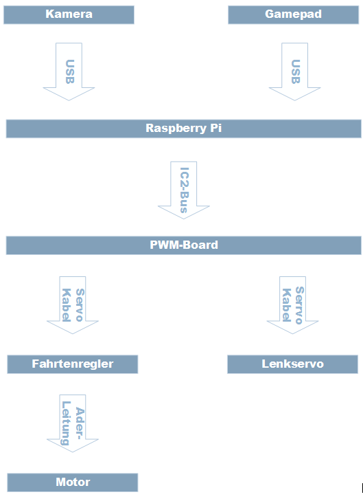

### **Blockschaltbild**

### ***Komponenten***:

Im folgendem wird ein Überblick über die Hardware Komponenten gegeben

**Rasperry Pit**

Der Mikrocomputer repräsentiert die Steuerzentrale des Fahrzeuges. Hier wird der Programmcode ausgeführt, welcher sämtliche Signale für die Eingabe sowie die Ausgabe verarbeitet. Des Weiteren ist der Mikrocomputer für die persistente Speicherung der Trainingsdaten zuständig.

Der Raspberry Pi 3 Model B+ ist ein Microcomputer mit einem 1,4GHZ Quadcore Prozessor mit 1GB Ram. Er verfügt über 4 USB Ports, W-Lan, Bluetooth 4.0 und 40 GPIO Pins mit IC2 Unterstützung. Die Stromversorgung wird durch einen Micro USB Adapter mit 12V und 2,1A bereitgestellt.

**Gamepad**

Das Gamepad wird zum Beenden des Programmcodes, zum Starten und Stoppen der Aufnahme von Trainingsdaten und für die Lenkung sowie Beschleunigung genutzt.

Das Logitech Gamepad F510 unterstützt Bluetooth und kann somit direkt mit dem on Board Bluetooth des RPi verbunden werden. Er verfügt über einfache on off Switches bietet aber auch sensitive Joysticks mit 256 und 32716 Stufen. Die Stromversorgung wird durch handelsüblichen 1,5V Mignon Batterien bereitgestellt.

**Kamera**

Die Kamera ist für die Bildaufnahme der Trainingsdaten zuständig.

Die Logitech HD910 verfügt über die Möglichkeit Bilder bis zu einer Auflösung von 1920:1280 bei 30fps aufzunehmen. Die Stromversorgung erfolgt über den USB Port.

**Servoregler**

Der Servoregler verteilt die PWM Signale der Software über den IC2 Port an die richtigen Servos und stellt einen Python Bibliothek zur einfachen Ansteuerung zur Verfügung. 

Als Servoregler kommt das Adafruit PWM-Board zum Einsatz. Welches bis zu 16 Servos ansteuern kann. Die Stromversorgung erfolgt über den IC2 Bus und wird vom Microcontroller bereitgestellt.

**Motorregler**

Der Motorregler nimmt die PWM Signale des Servo Bords entgegen und gibt je nach PWM Wert den Lastenstromkreis für den Motorantrieb frei.

Als Motorregler wurde ein No Name Motorregler mit 10A aus China verwendet. Dieser wird über PWM Signale gesteuert und verfügt über einen Hardware Notschalter um den LiPo Akku vom Motor zu trennen.

**Servo**

Der Servo ist ein kleiner Motor mit Stellwertmessung, er kann Steuerbefehle in genaue mechanische Bewegung transformieren. Er wird zum Lenken des Fahrzeuges genutzt.

Der SG90 9G ist ein im Modellbau bewährter Servo und ist für das Projekt bestens geeignet. Die Stromversorgung wird über den LiPo Akku durch den Motorregler und das Servo Board bereitgestellt.

**Motor**

Der Motor ist für den Antrieb in vorwärts sowie rückwärts Richtung zuständig. 

Es handelt sich um einen Gleichstrom-Motor mit 13000 Umdrehungen pro Minute. Die Stromversorgung des Motors durch den LiPo Akku wird vom Motorregler bereitgestellt.

**Stromversorgung**

Zur Stromversorgung des RPi wurde eine handelsübliche Powerbank mit 5000mAh und einem Ausgangsstrom von 1A verwendet.

Für den Lenkservo und den Motor wurde ein LiPo 2s Akku mit 850mAh verwendet.

