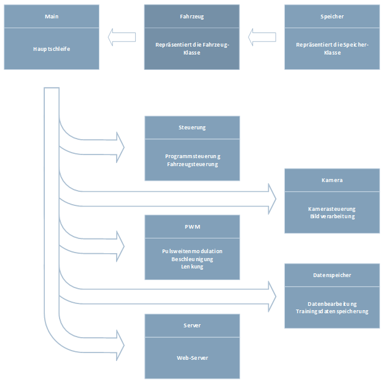

### **Software**

### **Beschreibung der Software**

Im Folgendem werden die einzelnen Softwarekomponenten beschrieben, die zur Realisierung des Projektes implementiert wurden.

Die Komponenten der Software sind mit Threads realisiert worden, da die Implementierung der Software mehrere über die gesamte Dauer des Programmes laufende Schleifen benötigt.

Erläuterungen zum Schema und hinzufügen einer Komponente finden sich als Kommentare im Quellcode

**Main**

In der Hauptschleife werden die Python Bibliotheken importiert. Weiterhin wird durch die Nutzung der Funktionen argparse des argparse Modules die Möglichkeit eröffnet, Variablenwerte über die Kommandozeile an das Programm zu übergeben. Mit diesen können die Grundeinstellungen, wie verwendete Kamera oder Dateipfad zum Speichern der Bilder geändert werden.

Weiterhin wird die Klasse Fahrzeug instanziiert, welche wiederum den Speicher instanziiert. Danach werden der Fahrzeugklassen Instanz der Reihe nach die Komponenten hinzugefügt.

Abschließend werden die Komponenten gestartet und die Hauptschleife wird gestartet.

**Fahrzeug**

In der Fahrzeugklasse wird die Liste der hinzugefügten Komponenten abgearbeitet. Jede hinzugefügte Komponente wird zuerst instanziiert, gestärten und danach in einer dauerschleife aktualisiert.

**Speicher**

In der Speicherklasse wird der Speicher realisiert. Sie besitzt eine Setter und eine Getter Methode. Somit können alle Komponenten aus dem Speicher lesen oder etwas hineinschreiben.

**Steuerung**

Zur Steuerung des Programmes dient eine Schleife welche im Millisekunden Takt den Status der Controllerknöpfe abfragt. Diese Schleife kann durch einen Knopf auf dem Controller beendet werden. Weiterhin besteht die Möglichkeit durch Knöpfe auf dem Controller die Aufnahme der Trainingsdaten zu starten und stoppen. Dies geschieht durch den Start des Datenspeichers. Zur Steuerung des Fahrzeugs werden die analog Sticks verwendet, welche über Auflösung von 32000 Zuständen verfügt und somit eine gedrosselte Steuerung der Lenkung und des Motors zur Verfügung stellt.

Weiterhin wird über die Funktionen des Protokolls evdev das Gamepad angesteuert sowie ausgelesen. Die aktuellen Werte der Steuerbefehle werden in den Speicher geschrieben um den Zugriff aus anderen Komponenten zu ermöglichen.

**Kamera**

Zur Initialisierung der Kamera wird die VideoCapture Funktion des cv2 Modules genutzt. Die Auflösung der Kamera wird auf 320x160 gesetzt. Danach wird ein durch einen sleep Befehl des Modules time die Einschaltverzögerung der Kamera ausgeglichen. Zur Bereitstellung der Kamerabilder wird eine Schleife genutzt welche im Millisekunden Takt Bilder von der Kamera aufnimmt und diese in einer Variable speichert.

**PWM**

Zur Steuerung des Fahrzeuges werden die Controller Werte in PWM Signale umgewandelt. Diese werden dann durch die set_pwm Funktion des Modules Adafruit_PCA9685 an den Motorregler und den Lenkservo weitergeleitet.

**Datenspeicher**

Der Datenspeicher greift in einer voreingestellten Geschwindigkeit synchron das Bildframe, die Steuerbefehle (Beschleunigung, Lenkung) und einen timestamp ab. Der timestamp wird durch die datetime Funktion des datetime Modules generiert. Das Bild wird aus dem Speicher ausgelesen. Mithilfe der imwrite Funktion des cv2 Modules wird das Bild im JPEG Format gespeichert. Die Pfade der Dateinamen werden in einer Liste zwischengespeichert. Als Dateiname wird der Wert des timestamp genutzt. Die Steuerbefehle werden aus dem Controller thread ausgelesen und ebenfalls jeweils in einer separaten Liste zwischengespeichert. Bei Beendigung der Aufnahmefunktion, werden mithilfe der Funktion witer des csv Modules die Dateipfade der Bilder und die Steuerbefehle aus den Listen in eine CSV Datei geschrieben. Für den Dateinamen der CSV Datei wird der erste generierte timestamp genutzt.

**Server**

Der Web-Server läuft in einen asynchronen Thread. Hier wird das Kamerabild mit den aktuellen Werten für Beschleunigung und Lenkung gestreamt. Weiterhin die Möglichkeit in die Sicht der KI zu wechseln bereitgestellt.

