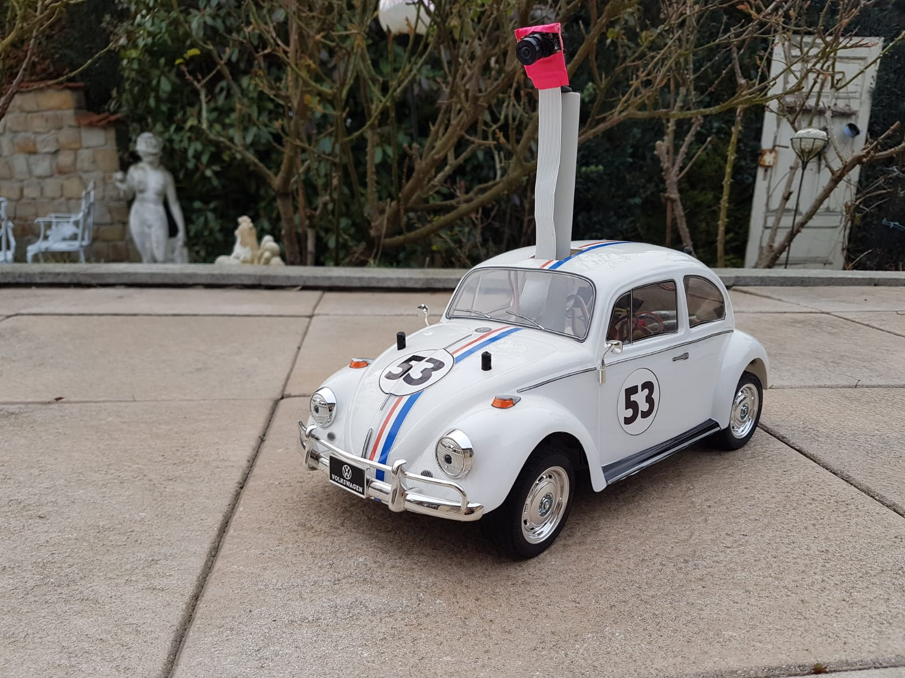

# RC-Car-Autopilot
Entwicklung eines Autopiloten für ein RC-Fahrzeug durch maschinelles lernen 




## Media

[Testfahrt Videos Youtoube](https://www.youtube.com/watch?v=siHh_I1PDYw&list=PLwBhQYl8W0NpmlF5_6Iv5jGDC2RXRzTEF)


## Installation

Das Repositorie clonen 

```sh
git clone https://github.com/Gieger/RC-Car-Autopilot.git
```

Starten der Software

```sh
sudo python3 herbie.py
```

## Nutzung

Die Software wird über das Gamepad gesteuert.


