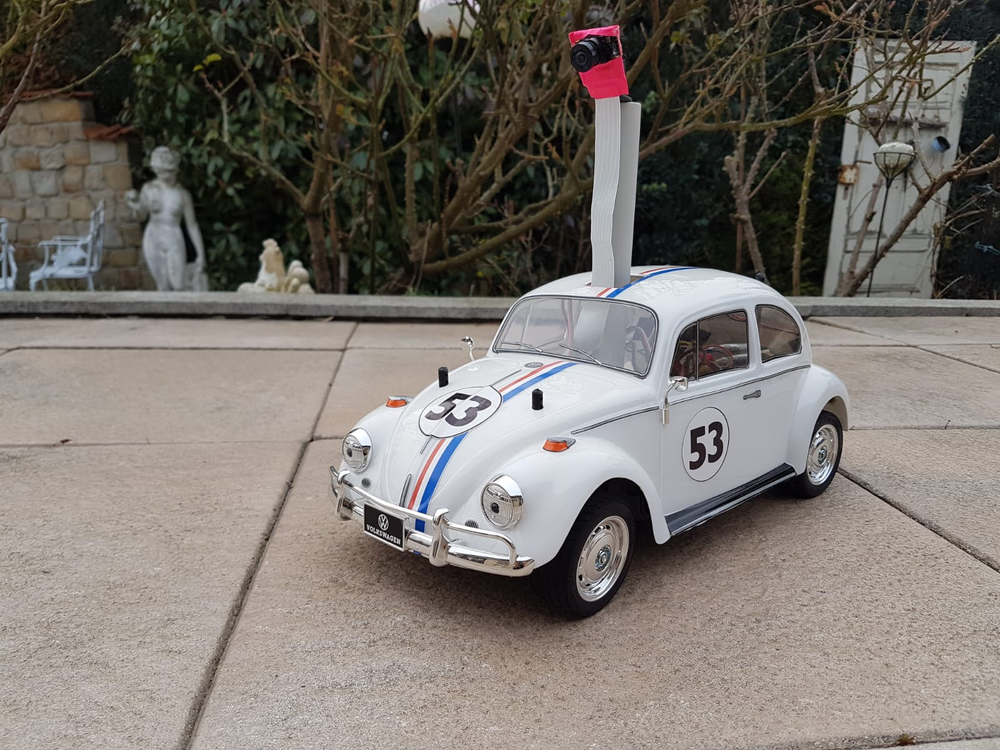

# RC-Car-Autopilot
> Entwicklung eines Autopiloten für ein RC-Fahrzeug durch maschinelles lernen 


[![Python Version][PY-url]][Py-image]




## Media

[Testfahrt Videos Youtoube](https://www.youtube.com/watch?v=siHh_I1PDYw&list=PLwBhQYl8W0NpmlF5_6Iv5jGDC2RXRzTEF)

## Voraussetzungen 

Der Programmcode ist unter Ubuntu 16.04 getestet.

Um das Programm zu starten werden folgende Abhängigkeiten benötigt:

* Linux 16.04 LTS
* Python 3.x

```sh
sudo apt-get update
sudo apt-get -y upgrade
sudo apt-get install -y python-pip

pip install tensorflow
pip install keras
pip install opencv-python
pip install pandas
pip install numpy
pip install sklearn
pip install tornado
```

## Installation

Das Repositorie clonen 

```sh
git clone https://github.com/Gieger/RC-Car-Autopilot.git
```

Starten der Software

```sh
sudo python3 herbie.py
```

## Nutzung

Die Software wird über das Gamepad gesteuert.

## Dokumentation

[Dokumentation](https://rc-car-autopilot.readthedocs.io/)


## Release History

* 0.1.0
    * Erste Fahrbereite Version
    * Änderungen: Modular aufgebaut
* 0.0.1
    * Start


Dennis Gieger 


## Credits

[Will Roscoe, Tawn Kramer and DonkeyCar Community](http://www.donkeycar.com/)

<!-- Markdown link & img dfn's -->
[Py-image]: (https://img.shields.io/pypi/pyversions/donkeycar.svg)
[PY-url]: https://img.shields.io/badge/python-3.x-blue.svg
